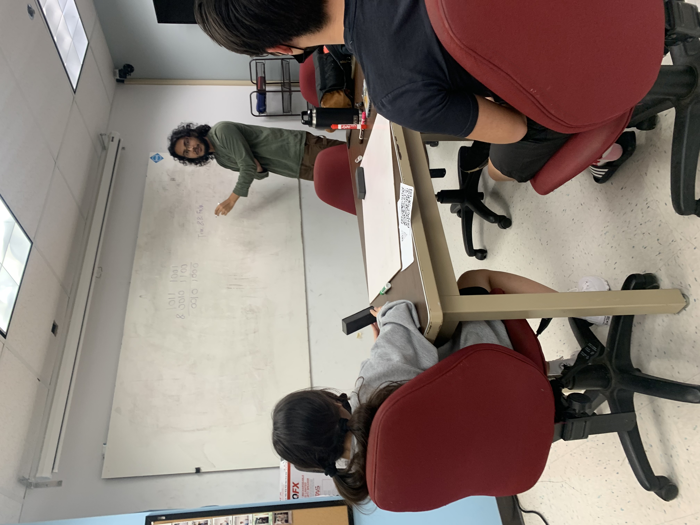

<figure class="figure float-end">
  
  <figcaption style="padding-left: 1rem" class="figure-caption">A group of Little Pandas reading their next problem, with  <a href="https://hwangkyh.github.io/">Big Panda (now President) Kelly</a> leading them (blue hoodie)</figcaption>
</figure>

Panda is a special interest group (SIG) at UH Manoa under their branch of the Association for Computing and Machinery (ACM). Panda hosts weekly meetings where groups of attendees or "Little Pandas" work through 3-5 leetcode/coding interview-style programming questions, guided by 1 "Big Panda" per group. Groups are formed based on level of experience, usually informed by the highest level computer science class taken by the Little Pandas in the group. 

## Our Goals

The set of problems revolve around a central concept each week, usually a data structure or topic that one of the classes learned that week or will learn soon. The club's goal with freshmen and sophomore computer science students is to help them come to grips with and get practice with the topics they will learn/have learned in class. For juniors or seniors the focus is more on helping them prepare for coding interviews, as they will already be more well-versed in the topics taught.

## My Responsibilities

As president of the club, it was my responsibility to make sure we had suitable problems each week based around our topic. I would lead a short weekly meeting with just the Big Pandas in preparation for our main meeting to make sure everyone was comfortable teaching about the topic and our specific problems for the week. I would usually explain various approaches that the Little Pandas might take for the problems as well as the optimal solution. I also acted as a Big Panda during the main meeting, leading a group of my own through the problems.

In adddition, I also represented the club at various events as well as presented/pitched the club to students near the beginning of the semester to rouse interest. 

## What I Learned

In being president of the club, I had a lot of responsibility, and I learned a lot of things I probably wouldn't have otherwise. I learned a lot about being a teacher as well as a leader. I also have a very strong grasp on computer science fundamentals like data structures and problem solving stragies, as I was forced to practice a lot. I'm very happy to have had the opportunity to lead this club, and gope to do more things like this in the future.

  

    

        
        

          
Me (with far too much hair) explaining bitwise operations to my group

        

    

  

  

    

        
        

          
<a href="https://jakehardy95.github.io/">Big Panda Jake</a> (blue shirt) leading his group.

        

    

  

  

    

        
        

          
A group of students getting started on a problem

        

    

  

 
  <figcaption class="figure-caption text-center">Some typical scenes at Panda meetings, not pictured are our other two Big Pandas from Spring 2022: <a href="https://alyssia-chen.github.io/">Alyssia Chen</a> and <a href="http://kobeyarai.com/">Kobey Arai</a></figcaption>

 

<a target="_blank" href="https://acmanoa.github.io/panda/">See the Panda website</a>

