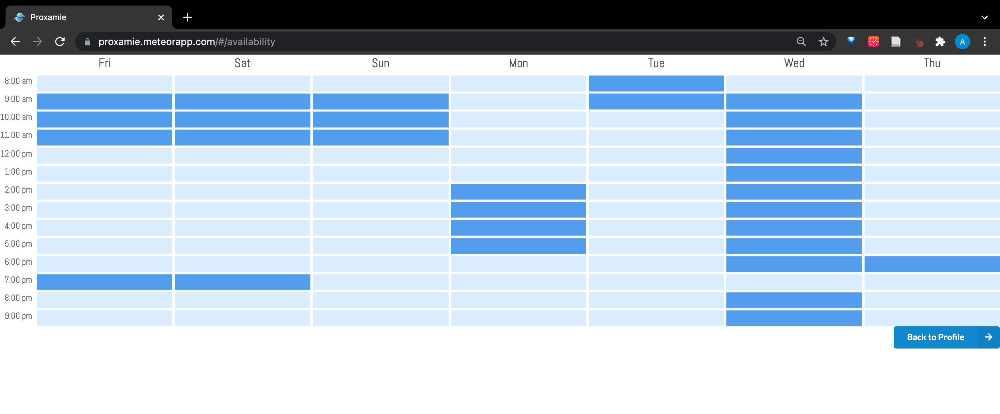

In my (and all my team mates') first Hackathon, we developed an app to help groups plan/schedule hangouts. Users can create and log into accounts, dropping them into their personal profile page. From here they can indicate their availabilities using a [when2meet](https://www.when2meet.com/) style interface. 

They can also create and join groups from this page, leading them to the group page. The group page features a unique code to share with others, allowing them to join the group from their profile page. Finally, from the groups page, any member can click on a calendar which visualizes the group's overlapping availabilities. Clicking on a date will pop up a form to create a hangout, which will be visible to all group members.

<figure class="figure float-end">
  
  <figcaption style="padding-left: 2rem" class="figure-caption">The create hangout form</figcaption>
</figure>

For this project, I helped plan the database structure and created most of the collections (tables) in it. This was important because there were many relations we needed to display all the info we wanted. For example, users need to see all the groups they are a part of, but group pages also need to display all of the users in the group. We had a couple [many-to-many](https://en.wikipedia.org/wiki/Many-to-many_(data_model)) relationships like this and as such had to plan out join tables. 

My other primary contribution was the **create hangout form** and hangouts table. Clicking on a date on the group page displays a form to create a new hangout. This form prompts you to choose a time (selected from a dropdown which tells you who will be available at each time) and enter a name and description for the hangout. This info is then put into the hangouts table in the group, for all in the group to see. 

<figure class="figure float-start">
  
  <figcaption class="figure-caption">The CDC guideline warning</figcaption>
</figure>

I also had the form display a **warning** when too many (>10) would be available for a hangout. Unfortunately this feature broke the morning that we were to present our app because of a new feature we added, but hey, that's hackathons. This ended up making it impossible to create a hangout with >10 people, though maybe that's for the best: we could've gotten in trouble promoting hangouts of more than 10 people.

All in all, I learned a lot from my first hackathon! I saw just how much can be done in just under a week. I think my group handled the project very well, we didn't step on each other's work too much and made sure to communicate. We met almost every day (multiple times in the later days) and chatted often. I think we were all quite drained from the whole thing though, and I will likely think twice before participating in any short hackathons in the future. I think it was a good experience for sure, just a very exhausting one.

 

<a href="https://github.com/ICS491-Fall2021/meteor-hackathon">See the GitHub repo</a>
||
<a href="https://proxamie.meteorapp.com/">See the deployed application</a>

